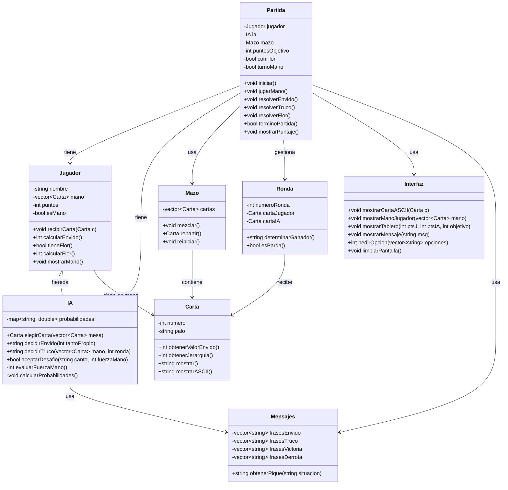
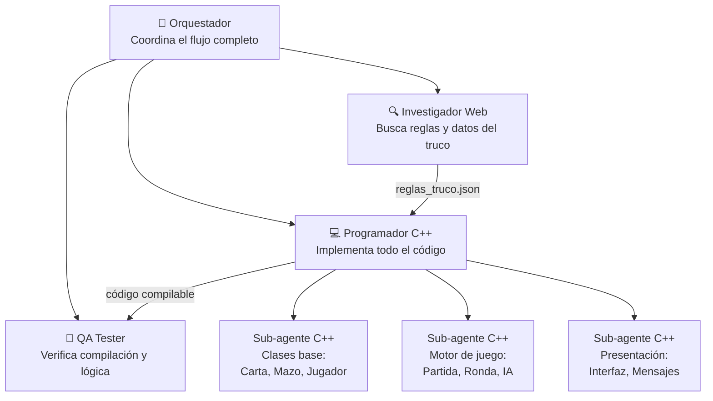

# 🃏 SDD — Proyecto Truco (C++)

**Documento de Diseño del Sistema**
**Versión:** 1.0
**Fecha:** 12 de septiembre de 2026
**Autor:** Federico (con asistencia de fefe-models)
**Perfil de proyecto:** `cpp-terminal`

---

## 1. Visión General del Proyecto

El **Proyecto Truco** es un juego de Truco Argentino jugable desde la terminal, donde un jugador humano se enfrenta a una inteligencia artificial. El programa está escrito en C++17 estándar, compilable con `g++`, y diseñado con una arquitectura modular de clases separadas en archivos `.h` / `.cpp`.

El juego implementa las mecánicas completas del truco argentino: envido (con cadena completa), truco/retruco/vale cuatro, y opcionalmente la flor. La IA toma decisiones basadas en un sistema de probabilidades dinámicas que evalúa la fuerza de su mano.

### Contexto

Este proyecto tiene un doble propósito:

- **Trabajo práctico escolar** de 6to año para la materia de C++.
- **Proyecto de portfolio** publicado en GitHub con documentación profesional bilingüe.

### Usuarios Objetivo

| Usuario | Perfil | Expectativa |
|---|---|---|
| **Jugador** | Cualquier persona con una terminal y conocimiento básico del truco | Jugar partidas completas contra una IA que desafíe |
| **Profesor/evaluador** | Docente de programación de 6to año | Código legible, modular, bien documentado y que compile sin errores |
| **Visitante de GitHub** | Desarrollador o curioso que encuentre el repo | README claro, instrucciones de compilación, estructura de proyecto profesional |

---

## 2. Stack Tecnológico

| Componente | Tecnología | Justificación |
|---|---|---|
| Lenguaje | **C++17** | Estándar moderno con soporte completo en g++, requerimiento de la materia |
| Compilador | **g++ -std=c++17 -Wall -Wextra** | Compilación estricta sin warnings |
| Build system | **Makefile** | Compila todos los archivos con un solo comando `make` |
| Librerías | **Solo STL estándar** | Sin dependencias externas (`<iostream>`, `<vector>`, `<string>`, `<algorithm>`, `<random>`, `<ctime>`, `<map>`) |
| Plataforma | **Terminal / Consola** | Entrada/salida estándar (`cin`/`cout`), arte ASCII |
| Control de versiones | **Git + GitHub** | Repositorio público con README bilingüe |

### Restricciones Técnicas

> [!IMPORTANT]
> - **Sin librerías externas.** Solo la STL estándar de C++17.
> - **Sin interfaz gráfica.** Todo ocurre en la terminal con texto y arte ASCII.
> - **Compilación limpia.** El código DEBE compilar con `-Wall -Wextra` sin generar ningún warning.
> - **Portabilidad.** El código debe funcionar en Windows (MinGW/MSYS2) y Linux sin cambios.
> - **Encoding.** Usar caracteres UTF-8 para los símbolos de los palos (♠ ♥ ♦ ♣) y los marcos ASCII (`┌ ─ ┐ │ └ ┘`). Si la terminal no soporta UTF-8, proveer un fallback con caracteres ASCII puros.

---

## 3. Reglas del Juego Implementadas

### 3.1 Configuración Inicial

Al ejecutar el programa, se le pregunta al jugador:

1. **¿A cuántos puntos?** → 15 o 30.
2. **¿Con flor?** → Sí o No.

No hay menú principal. El juego arranca directo a la configuración y después a la partida.

### 3.2 La Baraja

Se usa el **mazo español de 40 cartas** (sin 8 y sin 9), compuesto por 4 palos:

| Palo | Símbolo |
|---|---|
| Espada | ♠ |
| Basto | ♣ |
| Oro | ♦ |
| Copa | ♥ |

Cada palo tiene las cartas: 1, 2, 3, 4, 5, 6, 7, 10 (Sota), 11 (Caballo), 12 (Rey).

### 3.3 Jerarquía de Cartas (Pelea)

La fuerza de cada carta en la pelea de rondas, de mayor a menor:

| Pos | Carta | Nombre popular |
|:---:|---|---|
| 1º | 1 de Espada | Ancho de espada / La Espadilla |
| 2º | 1 de Basto | Ancho de basto |
| 3º | 7 de Espada | Siete bravo de espada |
| 4º | 7 de Oro | Siete bravo de oro |
| 5º | Todos los 3 | Los Tres (empatan entre sí) |
| 6º | Todos los 2 | Los Dos (empatan entre sí) |
| 7º | 1 de Oro, 1 de Copa | Ases falsos (empatan entre sí) |
| 8º | Todos los 12 | Reyes (empatan entre sí) |
| 9º | Todos los 11 | Caballos (empatan entre sí) |
| 10º | Todos los 10 | Sotas (empatan entre sí) |
| 11º | 7 de Basto, 7 de Copa | Sietes falsos (empatan entre sí) |
| 12º | Todos los 6 | Los Seis (empatan entre sí) |
| 13º | Todos los 5 | Los Cinco (empatan entre sí) |
| 14º | Todos los 4 | Los Cuatro (las más bajas) |

### 3.4 Envido

**Cálculo del tanto:**
- Cartas del 1 al 7: valen su número.
- Figuras (10, 11, 12): valen 0.
- Con dos cartas del mismo palo: `Carta_A + Carta_B + 20`.
- Sin cartas del mismo palo: se toma la carta de mayor valor facial (entre 0 y 7).

**Cadena de cantos de envido:**

```
Envido (2 pts) → Envido (4 pts acumulados) → Real Envido (7 pts acumulados) → Falta Envido (lo que falta)
```

| Canto | Puntos si "Quiero" | Puntos si "No quiero" |
|---|---|---|
| Envido | 2 | 1 |
| Envido + Envido | 4 | 2 |
| Real Envido (solo) | 3 | 1 |
| Envido + Real Envido | 5 | 2 |
| Envido + Envido + Real Envido | 7 | 4 |
| Falta Envido (solo) | Lo que falta | 1 |
| Envido + Falta Envido | Lo que falta | 2 |

**Timing:** Solo se puede cantar en la primera ronda, antes de que el jugador que lo va a cantar tire su carta.

**Prioridad envido > truco:** Si alguien canta truco en primera ronda sin que se haya resuelto el envido, el rival puede responder con envido. Se resuelve el envido primero, después se retoma el truco.

**Empate en envido:** Gana el jugador que es **mano**.

### 3.5 Truco

**Cadena de cantos:**

```
(Sin cantar = 1 pt) → Truco (2 pts) → Retruco (3 pts) → Vale Cuatro (4 pts)
```

| Canto | Puntos si "Quiero" | Puntos si "No quiero" |
|---|---|---|
| Sin canto | 1 | — |
| Truco | 2 | 1 |
| Retruco | 3 | 2 |
| Vale Cuatro | 4 | 3 |

**Regla fundamental:** Solo puede subir la apuesta el jugador que fue desafiado.

```
Jugador 1: "Truco"
Jugador 2: "Quiero, Retruco"    ← Solo J2 puede subir
Jugador 1: "Quiero, Vale Cuatro" ← Ahora solo J1 puede subir
Jugador 2: "Quiero" / "No quiero"
```

Se puede cantar truco en cualquier ronda (primera, segunda o tercera).

### 3.6 Rondas y Empates (Pardas)

Cada mano tiene 3 rondas. Gana la mano quien gane 2 de 3 rondas. Reglas de empate:

| Situación | Resolución |
|---|---|
| Primera ronda empatada | Define la segunda ronda |
| Segunda ronda empatada (habiendo ganador en primera) | Gana quien ganó la primera |
| Tercera ronda empatada | Gana quien ganó la primera ronda |
| Las tres rondas empatadas (triple parda) | **Gana la mano** |

### 3.7 La Mano

- El **mano** es quien tira primero en la primera ronda.
- El **pie** (el otro jugador) reparte las cartas.
- Los roles rotan después de cada mano jugada.
- **La mano gana todos los empates** (envido, flor, pardas triples).

### 3.8 Flor (Opcional)

Solo se activa si el jugador eligió "Con flor" al inicio.

- **Qué es:** 3 cartas del mismo palo.
- **Efecto:** Anula el envido. Si alguien tiene flor, no se puede jugar envido.
- **Cuándo:** Se canta obligatoriamente en la primera ronda, antes de jugar carta.
- **Puntuación:** Flor simple = 3 puntos.
- **Cálculo:** Suma de las 3 cartas + 20 (máximo 38, mínimo 20).
- Si ambos tienen flor: Contraflor (6 pts) o Contraflor al resto.

---

## 4. Diagrama UML de Clases



---

## 5. Arquitectura del Sistema

### 5.1 Estructura de Archivos

```
Proyecto_Truco/
├── main.cpp              # Punto de entrada — configura y lanza la partida
├── carta.h               # Declaración de la clase Carta
├── carta.cpp             # Implementación de Carta
├── mazo.h                # Declaración de la clase Mazo
├── mazo.cpp              # Implementación de Mazo
├── jugador.h             # Declaración de la clase Jugador
├── jugador.cpp           # Implementación de Jugador
├── ia.h                  # Declaración de la clase IA (hereda de Jugador)
├── ia.cpp                # Implementación de la IA con sistema de probabilidades
├── ronda.h               # Declaración de la clase Ronda
├── ronda.cpp             # Implementación de Ronda
├── partida.h             # Declaración de la clase Partida (motor del juego)
├── partida.cpp           # Implementación de Partida
├── interfaz.h            # Declaración de la clase Interfaz (arte ASCII, menús)
├── interfaz.cpp          # Implementación de Interfaz
├── mensajes.h            # Declaración de la clase Mensajes (frases de pique)
├── mensajes.cpp          # Implementación de Mensajes
├── Makefile              # Compilación automática con g++
├── README.md             # Documentación bilingüe (ES/EN)
└── datos/
    └── reglas_truco.json # Datos de referencia: jerarquía, valores, reglas
```

### 5.2 Flujo General del Programa

```
main.cpp
  │
  ├─► Pregunta: ¿A 15 o 30 puntos?
  ├─► Pregunta: ¿Con flor?
  │
  ├─► Crea Partida(puntosObjetivo, conFlor)
  │     │
  │     └─► LOOP mientras no terminoPartida():
  │           │
  │           ├─► mazo.reiniciar() + mazo.mezclar()
  │           ├─► Repartir 3 cartas a cada jugador
  │           ├─► Mostrar mano del jugador (arte ASCII)
  │           │
  │           ├─► [Si conFlor] → resolverFlor()
  │           ├─► [Primera ronda] → ¿Cantar envido? → resolverEnvido()
  │           │
  │           ├─► LOOP 3 rondas:
  │           │     ├─► Mano tira primero
  │           │     ├─► ¿Cantar truco? → resolverTruco()
  │           │     ├─► Pie tira carta
  │           │     ├─► Determinar ganador de ronda
  │           │     └─► ¿Alguien ganó 2 rondas? → salir del loop
  │           │
  │           ├─► Sumar puntos de la mano
  │           ├─► Mostrar tablero de puntaje
  │           └─► Rotar mano/pie
  │
  └─► Mostrar ganador final
```

### 5.3 Cómo Funcionan los Archivos Separados (Modo Tutor)

> [!NOTE]
> **Para Federico:** Como nunca trabajaste con múltiples archivos en C++, acá va la explicación.
>
> En C++, cuando un proyecto crece, se separa el código en **archivos de cabecera** (`.h`) y **archivos de implementación** (`.cpp`):
>
> - El **`.h`** (header) declara *qué existe*: la clase, sus atributos y los prototipos de las funciones. Es como el "índice" de un libro.
> - El **`.cpp`** (source) define *cómo funciona*: el cuerpo de cada función. Es el contenido de cada capítulo.
>
> Cuando un archivo necesita usar una clase de otro archivo, simplemente escribe `#include "carta.h"` al inicio. El compilador reemplaza esa línea con todo el contenido del `.h`.
>
> El **Makefile** se encarga de compilar cada `.cpp` por separado y después unir todos los resultados en un solo ejecutable. Así, si cambiás un solo archivo, solo se recompila ese — no todo el proyecto.

---

## 6. Inteligencia Artificial — Sistema de Probabilidades

### 6.1 Filosofía

La IA no es omnisciente. No sabe qué cartas tiene el jugador. Toma decisiones basándose **únicamente en la fuerza de su propia mano**, usando un sistema de probabilidades que simula la intuición de un jugador humano experimentado.

### 6.2 Evaluación de la Mano

La IA calcula un **índice de fuerza** de su mano en dos dimensiones:

1. **Fuerza de pelea** (para truco): Promedio de jerarquía de las 3 cartas. Rango: 1 (muy fuerte) — 14 (muy débil).
2. **Fuerza de envido** (para envido): El valor de envido de su mano. Rango: 0 — 33.

### 6.3 Tabla de Probabilidades de Canto (Envido)

| Tanto de la IA | Prob. de cantar Envido | Prob. de cantar Real Envido | Prob. de cantar Falta Envido |
|:---:|:---:|:---:|:---:|
| 0 — 20 (bajo) | 15% | 5% | 2% |
| 21 — 25 (medio-bajo) | 40% | 10% | 5% |
| 26 — 28 (medio-alto) | 70% | 30% | 10% |
| 29 — 31 (alto) | 90% | 60% | 25% |
| 32 — 33 (máximo) | 95% | 80% | 50% |

### 6.4 Decisión de Aceptar/Rechazar Envido

Si el jugador humano canta envido, la IA decide si aceptar basándose en su propio tanto:

| Tanto de la IA | Prob. de aceptar Envido | Prob. de aceptar Real Envido | Prob. de aceptar Falta Envido |
|:---:|:---:|:---:|:---:|
| 0 — 23 | 20% | 10% | 5% |
| 24 — 27 | 50% | 30% | 15% |
| 28 — 30 | 80% | 60% | 35% |
| 31 — 33 | 95% | 85% | 60% |

### 6.5 Decisión de Truco

La decisión de cuándo cantar truco es más compleja porque depende del **estado de la mano** (qué ronda es, si ganó alguna ronda, qué cartas le quedan):

| Situación | Prob. de cantar Truco |
|---|---|
| Tiene 2+ cartas en el top 6 de jerarquía | 75% |
| Tiene 1 carta top 6 + 1 carta media | 40% |
| Ganó la primera ronda y tiene carta fuerte para la segunda | 60% |
| Va perdiendo y le queda solo 1 carta débil | 10% (farol) |
| Ganó 2 rondas (ya ganó la mano, no necesita cantar) | 15% (por diversión / puntaje extra) |

### 6.6 Estrategia de Juego de Cartas

La IA no siempre tira la más fuerte primero. Tiene dos modos:

- **Modo agresivo** (60% del tiempo): Tira la carta más fuerte disponible para asegurar la ronda.
- **Modo conservador** (40% del tiempo): Tira una carta media/baja para "reservar" la fuerte, intentando que el rival se confíe y después sorprenderlo.

La probabilidad de cada modo se ajusta según el estado de la partida (si va ganando o perdiendo en puntaje global).

### 6.7 Frases de Pique

La IA acompaña sus acciones con frases de pique en español rioplatense. Ejemplos por categoría:

| Situación | Frases posibles |
|---|---|
| Canta envido | "Envido, papá!", "Envido... si te animás", "Envido, dale" |
| Canta truco | "Truco! A ver qué tenés", "¡Truco, macho!", "Trucazo, dale" |
| Acepta desafío | "¡Quiero! Vení tranquilo", "Dale, quiero", "Quiero... vas a ver" |
| Rechaza desafío | "No quiero, paso...", "Me voy al mazo", "Esta vez no, jefe" |
| Gana ronda | "¡Tomá! Esa la gané", "Jajá, esa me la llevo", "Plop, mi ronda" |
| Pierde ronda | "Bien jugada, loco", "Uf, esa dolió", "Bueno, quedan cartas" |
| Gana la partida | "¡Soy el campeón! 🏆", "Se acabó, capo. Otra más?" |

---

## 7. Plan de Sub-Agentes (fefe-models)

### 7.1 Equipo Asignado



### 7.2 Roles y Límites Estrictos (Strict Boundaries)

#### Orquestador
- **Rol:** Coordina el flujo de trabajo, asigna tareas, monitorea progreso.
- **Puede:** Leer cualquier archivo, enviar mensajes a subagentes, crear artefactos de planificación.
- **No puede:** Modificar código fuente directamente.

#### Investigador Web
- **Rol:** Buscar las reglas oficiales del truco argentino, jerarquía de cartas, valores de envido, y estructurarlos en un JSON de referencia.
- **Puede:** Buscar en la web, escribir archivos `.json`, `.csv`, `.txt` en la carpeta `datos/`.
- **No puede:** Modificar archivos `.cpp`, `.h`, `Makefile`, ni `README.md`.
- **Entregable:** `datos/reglas_truco.json`

#### Programador C++
- **Rol:** Implementar todo el código del juego.
- **Puede:** Escribir archivos `.cpp`, `.h`, `.hpp`, `Makefile`, `CMakeLists.txt`.
- **No puede:** Modificar archivos `.json`, `.csv`, ni archivos de datos del investigador.
- **Sub-agentes propios:** Divide el trabajo en 3 sub-tareas para manejar la ventana de contexto:
  1. **Clases base:** `carta.h/cpp`, `mazo.h/cpp`, `jugador.h/cpp`
  2. **Motor de juego:** `partida.h/cpp`, `ronda.h/cpp`, `ia.h/cpp`
  3. **Presentación:** `interfaz.h/cpp`, `mensajes.h/cpp`, `main.cpp`, `Makefile`
- **Entregables:** Todos los archivos `.h`, `.cpp`, y el `Makefile`.

#### QA Tester
- **Rol:** Verificar que todo funcione correctamente.
- **Puede:** Leer cualquier archivo, ejecutar comandos de compilación y ejecución.
- **No puede:** Modificar ningún archivo de código.
- **Checklist:**
  - [ ] ¿Compila con `g++ -std=c++17 -Wall -Wextra` sin warnings?
  - [ ] ¿El programa se ejecuta sin segfaults?
  - [ ] ¿La jerarquía de cartas está correctamente implementada?
  - [ ] ¿El cálculo de envido es correcto?
  - [ ] ¿Las reglas de empate (pardas) funcionan?
  - [ ] ¿La cadena truco→retruco→vale cuatro respeta "solo sube el desafiado"?
  - [ ] ¿Los comentarios están en español?
  - [ ] ¿Existe un Makefile funcional?
  - [ ] ¿La IA toma decisiones coherentes?

### 7.3 Flujo de Ejecución entre Agentes

```
Fase 0: SDD (este documento) ✅ → Aprobación del usuario
Fase 1: Investigador Web → genera datos/reglas_truco.json
Fase 2: Programador C++ (Sub-agente 1) → clases base
Fase 3: Programador C++ (Sub-agente 2) → motor de juego (depende de Fase 2)
Fase 4: Programador C++ (Sub-agente 3) → presentación + Makefile (depende de Fase 2 y 3)
Fase 5: QA Tester → verificación integral
Fase 6: Generación del README.md bilingüe
```

---

## 8. Entregables Esperados

| Archivo | Descripción | Responsable |
|---|---|---|
| `carta.h` / `carta.cpp` | Clase Carta con jerarquía y valor de envido | Programador C++ |
| `mazo.h` / `mazo.cpp` | Clase Mazo con mezcla y reparto | Programador C++ |
| `jugador.h` / `jugador.cpp` | Clase base Jugador con mano y puntaje | Programador C++ |
| `ia.h` / `ia.cpp` | Clase IA con sistema de probabilidades | Programador C++ |
| `ronda.h` / `ronda.cpp` | Clase Ronda con resolución de bazas | Programador C++ |
| `partida.h` / `partida.cpp` | Motor principal del juego | Programador C++ |
| `interfaz.h` / `interfaz.cpp` | Arte ASCII y presentación visual | Programador C++ |
| `mensajes.h` / `mensajes.cpp` | Frases de pique de la IA | Programador C++ |
| `main.cpp` | Punto de entrada, configuración inicial | Programador C++ |
| `Makefile` | Build automático con g++ | Programador C++ |
| `datos/reglas_truco.json` | Referencia de reglas, jerarquía y valores | Investigador Web |
| `README.md` | Documentación bilingüe (ES/EN) | Orquestador |

**Total: 19 archivos de código + 1 JSON de datos + 1 README + 1 Makefile = 22 archivos.**

---

## 9. Restricciones del Usuario

| Regla | Detalle |
|---|---|
| **Idioma del código** | Español — variables, funciones, comentarios, mensajes al usuario |
| **Idioma del README** | Bilingüe (español + inglés) |
| **Estilo de código** | Legibilidad sobre concisión. Si algo toma más líneas pero se entiende mejor, se prefiere la versión larga |
| **Modo tutor** | Activado. Cada agente debe explicar qué hizo y por qué |
| **Comentarios** | Todo el código generado debe tener comentarios claros en español |
| **Nomenclatura** | camelCase o snake_case consistente (elegir uno y mantenerlo en todo el proyecto) |

---

## 10. Criterios de Éxito

El proyecto se considera completo y exitoso cuando se cumplan **todos** estos criterios:

- [ ] El código compila con `make` sin errores ni warnings.
- [ ] El programa se ejecuta y permite jugar una partida completa de truco contra la IA.
- [ ] El envido funciona con la cadena completa (Envido→Envido→Real Envido→Falta Envido).
- [ ] El truco funciona con la cadena completa (Truco→Retruco→Vale Cuatro) y respeta "solo sube el desafiado".
- [ ] La flor se activa/desactiva según la configuración del jugador.
- [ ] Las reglas de empate (pardas y mano) se resuelven correctamente.
- [ ] Las cartas se muestran en arte ASCII en la terminal.
- [ ] El tablero de puntaje se muestra con marcos decorativos ASCII.
- [ ] La IA toma decisiones coherentes basadas en probabilidades (no juega al azar puro).
- [ ] La IA dice frases de pique en español rioplatense.
- [ ] La partida termina cuando alguien llega al puntaje objetivo (15 o 30).
- [ ] El README.md bilingüe está completo con instrucciones de compilación y uso.
- [ ] Todos los archivos `.h`/`.cpp` están separados por clase.
- [ ] Todo el código tiene comentarios en español explicando las secciones principales.

---

## 11. Riesgos y Mitigaciones

| Riesgo | Impacto | Mitigación |
|---|---|---|
| La IA es demasiado predecible | El juego se vuelve aburrido | Sistema de probabilidades con rangos, no decisiones fijas |
| La lógica de envido tiene bugs | Puntaje incorrecto, partida injusta | QA Tester verifica con casos conocidos (33 máximo, 0 mínimo, empates) |
| La compilación multi-archivo falla | El proyecto no se puede evaluar | Makefile testeado; modo tutor explica cómo funciona |
| El arte ASCII no se ve bien en todas las terminales | Presentación rota | Fallback con caracteres ASCII puros si UTF-8 no funciona |
| La ventana de contexto no alcanza para todo | Agentes pierden coherencia | El Programador C++ usa 3 sub-agentes, cada uno con un scope limitado |

---

> [!IMPORTANT]
> **Este SDD es el contrato entre el usuario y el equipo de agentes.** Ningún agente puede empezar a implementar hasta que Federico apruebe explícitamente este documento. Si durante la implementación surge algo que contradice este SDD, se consulta primero antes de proceder.
